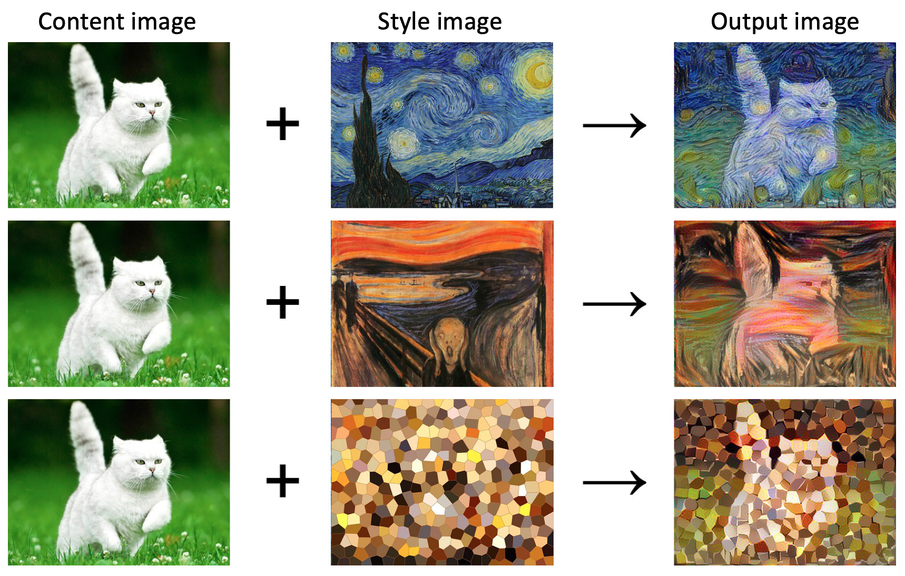
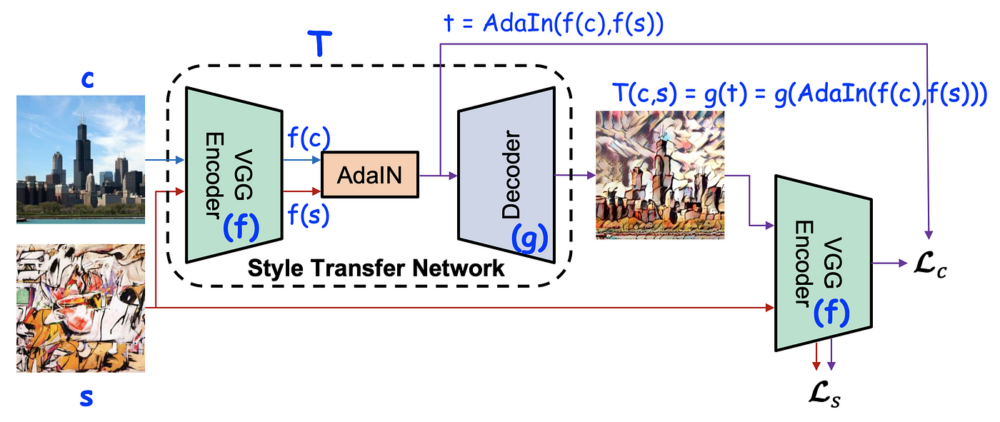
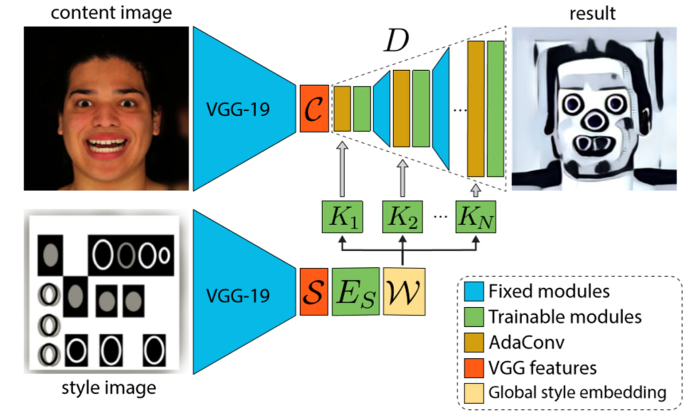

# Adaptive Convolutions for Structure-Aware Style Transfer
Style transfer between images is an artistic application of CNNs, where the ‘style’ of one image is transferred onto another image while preserving the latter’s content.

## Contents
### Style Transfer Details
We have two purposes in style transfer
* Transferring statistical properties
* Transferring geometric properties

### Style Transfer Methods
  * Adaptive Instance Normalization
  * Adaptive Convolutions

### AdaIN Style Transfer Network
This method only transfers statistical properties

### AdaConv Style Transfer Network
This method transfers both statistical and geometric properties

